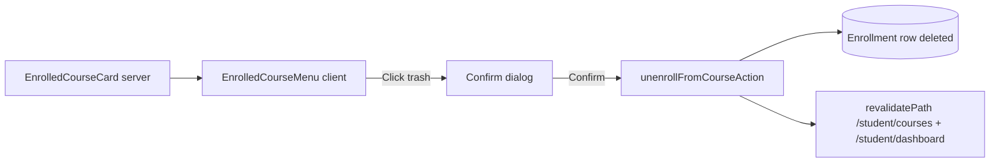

## Goal

On the student "My courses" page ([app/student/courses/page.tsx](app/student/courses/page.tsx)), make the existing 3-dot icon on each card open a popover containing a destructive "Unenroll" action (trash icon). Confirming removes the student's `Enrollment` row for that course, and the page revalidates.

## Approach

Extract the 3-dot button into a small client component so the rest of [components/student/enrolled-course-card.tsx](components/student/enrolled-course-card.tsx) stays a server component. The new client component owns popover state and calls a new server action.

Lesson progress is keyed by `(lessonId, studentId)` ([prisma/schema.prisma](prisma/schema.prisma) line 178), not by `enrollmentId`, so we can hard-delete the `Enrollment` row safely. If the student later re-enrolls, prior progress is preserved automatically (Udemy-style). No schema changes needed.

## Changes

### 1. New server action: `unenrollFromCourseAction`

Add to [app/student/actions/enrollment.ts](app/student/actions/enrollment.ts) alongside `enrollInCourseAction`:

- Require `session.user.role === STUDENT`.
- `db.enrollment.delete({ where: { courseId_studentId: { courseId, studentId: session.user.id } } })` wrapped in try/catch (treat `P2025 record not found` as idempotent success).
- `revalidatePath` for `/student/courses`, `/student/dashboard`, `/student/browse`, `/student/achievements`.
- Return `{ ok: true } | { ok: false, message }`.

### 2. New client component: `components/student/enrolled-course-menu.tsx`

- Props: `{ courseId: string; courseTitle: string }`.
- Renders the 3-dot button (same styles as the current static button).
- Opens a popover anchored to the button with a single item: `Unenroll` with `Trash2` icon (rose accent).
- Clicking `Unenroll` switches the popover into a small inline confirm view: "Unenroll from this course? Your progress will be saved if you re-enroll later." with `Cancel` and `Confirm` buttons.
- On confirm, runs `unenrollFromCourseAction(courseId)` in `useTransition`, then `router.refresh()`.
- Closes on `Escape`, click outside (via a transparent backdrop button for a11y), and after success.

### 3. Wire into the card

In [components/student/enrolled-course-card.tsx](components/student/enrolled-course-card.tsx), replace the static button at lines 37-43 with `<EnrolledCourseMenu courseId={courseId} courseTitle={title} />`. The `MoreVertical` icon import moves into the new menu component.

## Out of scope

- Soft "DROP" status (would require extending `EnrollmentStatus` enum + migration).
- Cascading delete of `LessonProgress` / `AssignmentSubmission` rows (intentionally preserved so re-enrollment resumes prior progress).
- Undo toast — confirm dialog is the safety net.
