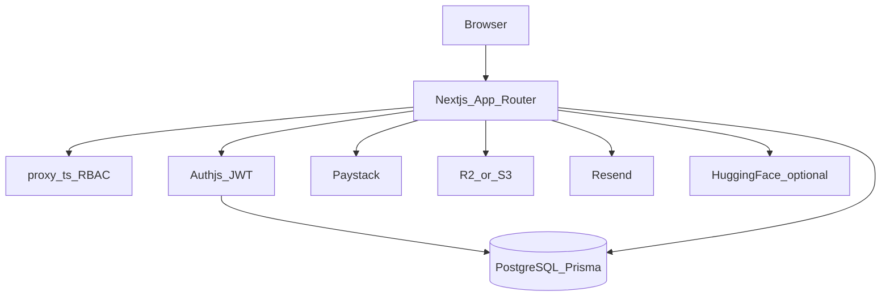

# Pharm LMS — Developer Handover Guide

**Audience:** PharmAnalytics engineers taking ownership of this codebase  
**Company repo:** https://github.com/PharmAnalytics/PharmAnalytics-LMS-  
**Package manager:** pnpm · **Node:** 22+ · **Framework:** Next.js 16 (App Router)

This document is the single walkthrough for access transfer, architecture, local setup, per-role smoke tests, known MVP gaps, and production ops. Deploy details live in [DEPLOYMENT.md](./DEPLOYMENT.md).

---

## 1. What you are receiving

Pharm LMS is a pharmacy learning platform with four role portals plus a public marketing/catalog surface:

| Role | Portal | Purpose |
|------|--------|---------|
| **Student** | `/student/*` | Browse/buy courses, learn, quizzes, certificates, meetings, messages |
| **Tutor** | `/tutor/*` | Create/manage courses, assignments, communication, revenue, payouts |
| **Mentor** | `/mentor/*` | Coaching profile, availability, meeting CRM (Jitsi) |
| **Admin** | `/admin/*` | Course approvals, people CRM, payments, coupons, badges |

**Automated health (pre-handover):** unit tests **9/9 pass**; production `pnpm build` should be verified on your machine after clone.

---

## 2. Access & secrets transfer checklist

Transfer these **out of band** (password manager / secure channel). **Never commit secrets.**

| Asset | Owner after handover | Notes |
|-------|----------------------|--------|
| GitHub: `PharmAnalytics/PharmAnalytics-LMS-` | ☐ | `main` is the delivery branch |
| PostgreSQL (`DATABASE_URL`) | ☐ | Neon recommended; see DEPLOYMENT.md |
| `AUTH_SECRET` | ☐ | 32+ random chars; rotating it logs everyone out |
| Paystack live/test keys + webhook | ☐ | Webhook: `https://<domain>/api/paystack/webhook` |
| Resend API + sending domain | ☐ | Required for signup OTP email |
| Cloudflare R2 (or S3) credentials | ☐ | Course media uploads |
| Google/Apple OAuth (if used) | ☐ | Update redirect URIs to production domain |
| AWS Amplify / hosting account | ☐ | Optional; see DEPLOYMENT.md |
| Domain DNS | ☐ | Must match `AUTH_URL` / `NEXT_PUBLIC_SITE_URL` |
| Seed admin email/password | ☐ | **Change** from defaults immediately after first seed |

Default seed (change before production):

- Email: `SEED_ADMIN_EMAIL` (example `admin@pharmlms.com`)
- Password: `SEED_ADMIN_PASSWORD` (example `ChangeMe123!`)

---

## 3. Architecture (short)



- **Auth:** Auth.js (NextAuth v5), JWT sessions; credentials + optional Google/Apple. Inactive users (`isActive: false`) cannot sign in.
- **Route protection:** [`proxy.ts`](../proxy.ts) gates `/student`, `/tutor`, `/mentor`, `/admin` pages. API routes enforce auth in each handler.
- **Payments:** Paystack charges **NGN**; display currency may be USD for non-NG visitors. Tutor withdrawals = admin-approved Paystack transfers.
- **Media:** S3-compatible API via `R2_*` env vars ([`lib/storage/r2.ts`](../lib/storage/r2.ts)).
- **Meetings:** Jitsi (`JITSI_DOMAIN`, default `meet.jit.si`).

---

## 4. Local setup (engineers)

```bash
git clone https://github.com/PharmAnalytics/PharmAnalytics-LMS-.git
cd PharmAnalytics-LMS-
pnpm install
cp .env.example .env
# Fill DATABASE_URL (Neon: append ?sslmode=require) + AUTH_SECRET at minimum
pnpm db:migrate:deploy   # applies prisma/migrations baseline on empty DB
pnpm db:seed             # demo admin, badges, blog posts
pnpm dev                 # http://localhost:3000
```

**First-time / empty database:** if `db:migrate:deploy` fails because the DB already has tables from an old partial setup, run `pnpm db:sync` once to align schema, then `pnpm dlx prisma migrate resolve --applied 20260425110000_baseline`, then `pnpm db:seed`.

**Reset test data (dev only):** `pnpm db:reset` wipes the database and re-applies migrations + seed. Do not run against production.

Useful scripts:

| Command | Purpose |
|---------|---------|
| `pnpm build` / `pnpm start` | Production build & serve |
| `pnpm test` | Unit tests |
| `pnpm db:migrate:deploy` | Apply migrations in production / fresh DB |
| `pnpm db:sync` | Push schema from `schema.prisma` (recovery / first-time without migrate) |
| `pnpm db:reset` | Dev only: drop all data, re-apply migrations + seed |
| `pnpm db:generate` | Regenerate Prisma client |

If you see `JWTSessionError` / `no matching decryption secret` locally: clear cookies for `localhost` (session was encrypted with a different `AUTH_SECRET`).

When switching portals (e.g. student → admin), the app signs you out automatically so you are not redirected away from the login page. On Vercel or Amplify, keep `AUTH_URL` and `NEXT_PUBLIC_SITE_URL` aligned with the live domain to avoid session drops.

---

## 5. Environment variables

### Required for a usable production app

| Variable | Purpose |
|----------|---------|
| `DATABASE_URL` | PostgreSQL connection string |
| `AUTH_SECRET` | JWT signing (or `NEXTAUTH_SECRET`) |
| `AUTH_TRUST_HOST` | Set `true` on hosted environments |
| `AUTH_URL` | Canonical HTTPS origin (no trailing slash) |
| `NEXT_PUBLIC_SITE_URL` | Same origin (OG + client-facing URLs) |
| `NEXT_PUBLIC_PAYSTACK_PUBLIC_KEY` | Checkout |
| `PAYSTACK_SECRET_KEY` | Server charges, verify, webhook, transfers |
| `RESEND_API_KEY` / `EMAIL_FROM` | Signup OTP |
| `R2_ENDPOINT` / `R2_REGION` / `R2_ACCESS_KEY_ID` / `R2_SECRET_ACCESS_KEY` / `R2_BUCKET_NAME` | Media |

### Optional

| Variable | Purpose |
|----------|---------|
| `AUTH_GOOGLE_ID` / `AUTH_GOOGLE_SECRET` | Google OAuth |
| `AUTH_APPLE_ID` / `AUTH_APPLE_SECRET` | Apple Sign In |
| `HUGGINGFACE_API_KEY` | AI quiz / course chat |
| `DEFAULT_DISPLAY_CURRENCY` | Fallback when geo unknown (`USD` / `NGN`) |
| `EXCHANGERATE_API_KEY` | FX rates (else public API) |
| `PG_POOL_MAX` | Prefer `5` on Amplify-like hosts |
| `JITSI_DOMAIN` | Meeting host |
| `SEED_ADMIN_*` | Seed script only |

Full comments: [`.env.example`](../.env.example).

---

## 6. Production deploy

Follow **[DEPLOYMENT.md](./DEPLOYMENT.md)** (AWS Amplify + Neon free-tier path).

After first deploy:

1. `pnpm db:migrate:deploy` against production `DATABASE_URL`
2. Seed admin once; **change password**
3. Set Paystack webhook to `https://<domain>/api/paystack/webhook` (`charge.success`)
4. Align `AUTH_URL` and `NEXT_PUBLIC_SITE_URL` with the live domain; redeploy

**Hosting note:** Amplify docs list Next.js SSR through v15. This app is on Next.js 16 with a symlink workaround (`amplify.yml` + `scripts/resolve-next-symlinks.js`). If Amplify fails, use the EC2 fallback in DEPLOYMENT.md.

---

## 7. Day-1 smoke tests (all cores)

Run these on staging/production after env + migrations. Use separate browser profiles per role if needed.

### 7.1 Public / marketing

- [ ] `/` home loads (hero, sections, no crash)
- [ ] `/courses` search/filter works
- [ ] `/courses/[id]` course detail loads
- [ ] `/validate` certificate verify UI loads
- [ ] `/contact`, `/about`, `/teach`, `/become-a-mentor` load
- [ ] “Watch demo” / tutorial opens YouTube embed (not a local mp4)

### 7.2 Student

- [ ] Signup → OTP email arrives (Resend) → verify → login
- [ ] Dashboard loads; profile edit saves
- [ ] Browse catalog; open a free course → enroll
- [ ] Paid course → Paystack checkout → enrollment after success
- [ ] Close Paystack popup after pay → webhook still completes purchase
- [ ] Open enrolled course: play lesson, mark progress, notes
- [ ] Section quiz attempt; AI quiz page loads (if HF key set)
- [ ] Forum post/reply; assignment submit (if course has one)
- [ ] Complete course path → certificate page / print
- [ ] Browse tutors/mentors; request/join a meeting; send a message

### 7.3 Tutor

- [ ] Signup / login → `/tutor/courses`
- [ ] Create course (multi-step) → edit basics, curriculum, pricing
- [ ] Upload lecture media (R2 configured)
- [ ] Submit course for review
- [ ] Create assignment; view enrolled students
- [ ] Announcements / forum / messages / meetings
- [ ] Performance: revenue / payments pages load
- [ ] Payouts: add bank account (resolve), request withdrawal

### 7.4 Mentor

- [ ] Signup / login → complete profile → submit for admin review
- [ ] After admin activation: set weekly availability
- [ ] Receive coaching request → accept/reject
- [ ] Join meeting (Jitsi)

### 7.5 Admin

- [ ] Login (credentials only)
- [ ] Dashboard stats load
- [ ] Course approvals: publish / reject with feedback
- [ ] People CRM: find student/tutor/mentor; deactivate/reactivate
- [ ] Mentor applications: approve/reject
- [ ] Payments → transactions list
- [ ] Withdrawals: approve (Paystack transfer) / reject
- [ ] Platform fee settings save
- [ ] Coupons create/toggle; badges list/create
- [ ] Messages / broadcast

### 7.6 Payments end-to-end

- [ ] Initialize + verify purchase creates `CoursePurchase` + enrollment
- [ ] Webhook signature rejects bad `x-paystack-signature`
- [ ] Tutor wallet increases after successful paid sale (per fee split)
- [ ] Admin withdrawal approval creates Paystack transfer when balance allows

---

## 8. Functional matrix — what works vs MVP stubs

### Student — working

Browse/buy, enroll, player, quizzes, AI quiz, forum, certificates, meetings, messages, wishlist, achievements, leaderboard UI.

**Soft / incomplete**

- Some catalog star ratings are placeholders
- Leaderboard period toggles are largely cosmetic
- Mobile lesson chrome may be incomplete vs desktop

### Tutor — working

Course create/manage, curriculum, pricing, submit for review, uploads, assignments, communication, revenue/payments views, payouts, profile.

**Soft / incomplete (do not sell as finished)**

| Area | Status |
|------|--------|
| `/tutor/.../manage/structure` | Tips only |
| `/tutor/.../manage/promotions` | Static cards, no campaigns |
| `/tutor/.../manage/accessibility` | Checkboxes not persisted |
| Captions / some film flows | Upload UI not fully wired into curriculum |
| Traffic & conversion | Explicit analytics placeholder |
| Messages badge | Hardcoded in places |

### Mentor — working

Profile review flow, availability, coaching meetings.

**By design (MVP):** no course studio, no Paystack wallet, no full messaging CRM in mentor portal.

### Admin — working

Approvals, CRM, mentor applications, transactions, withdrawals, settings, coupons, badges, messages.

**Soft**

- `/admin/users` redirects to students (no unified all-users page)
- Mentor applications page may be easy to miss in nav
- Login UI may hint default seed credentials — remove/change for production

### Shared / public stubs

- Newsletter subscribe button: **not wired** (TODO in UI)
- Legal privacy/terms: **placeholder copy**
- Contact-admin SSO: deferred (“later phase”)
- Rate limiting: **in-memory per instance** (not shared across multiple servers)

---

## 9. Ops runbook

| Task | Command / action |
|------|------------------|
| Apply DB migrations (prod) | `DATABASE_URL=... pnpm db:migrate:deploy` |
| Seed admin (once) | `SEED_ADMIN_EMAIL=... SEED_ADMIN_PASSWORD=... pnpm db:seed` |
| Redeploy | Push to `main` (Amplify) or restart process (EC2) |
| Rotate `AUTH_SECRET` | Update env → redeploy → all users must log in again |
| Paystack webhook failures | Check Amplify/server logs; verify secret key matches dashboard |
| Neon cold start | First request may be slow; pool settings in `lib/prisma.ts` |

---

## 10. Ownership (fill at handover meeting)

| Area | Name / team | Contact |
|------|-------------|---------|
| Product owner | | |
| Engineering lead | | |
| AWS / hosting | | |
| Database (Neon/RDS) | | |
| Paystack merchant | | |
| Resend / email domain | | |
| Media bucket (R2/S3) | | |
| Domain / DNS | | |
| On-call / support | | |

---

## 11. Related docs

- [DEPLOYMENT.md](./DEPLOYMENT.md) — AWS Amplify + Neon step-by-step  
- [Project_Report.md](./Project_Report.md) — product narrative (some “gaps” may be outdated; prefer §8 above)  
- [README.md](../README.md) — quick start  

---

*Handed over for continued ownership by PharmAnalytics. Keep secrets out of git.*
